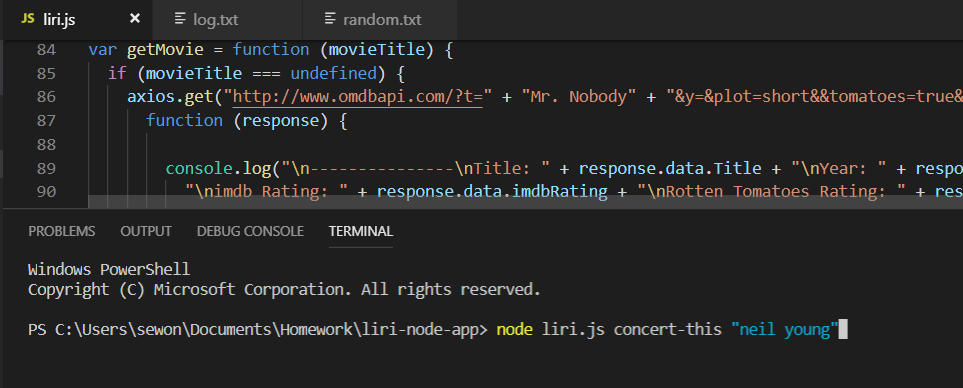
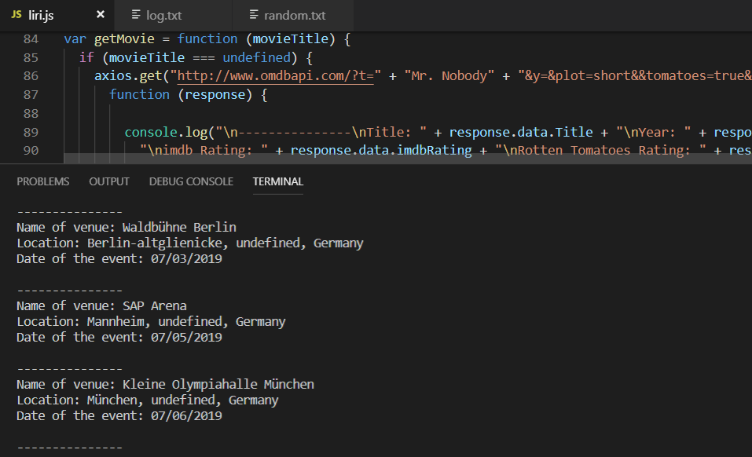
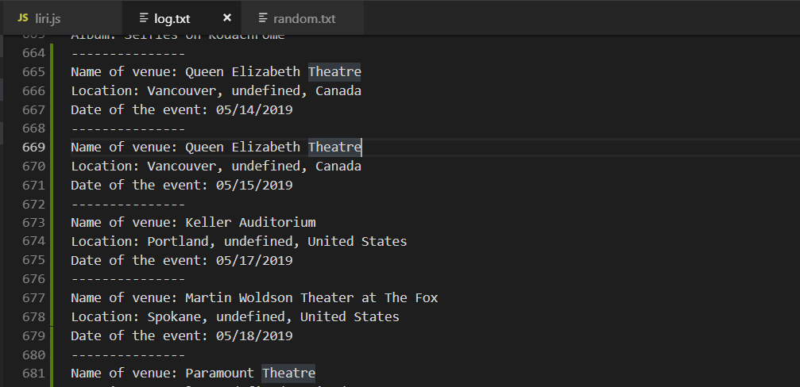
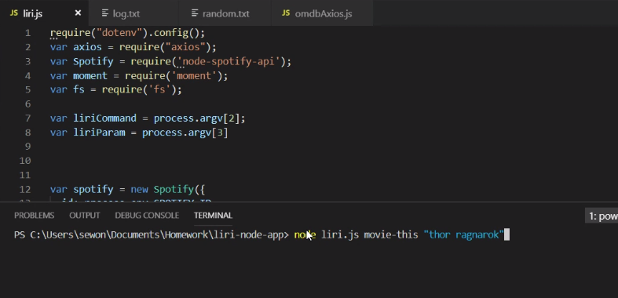
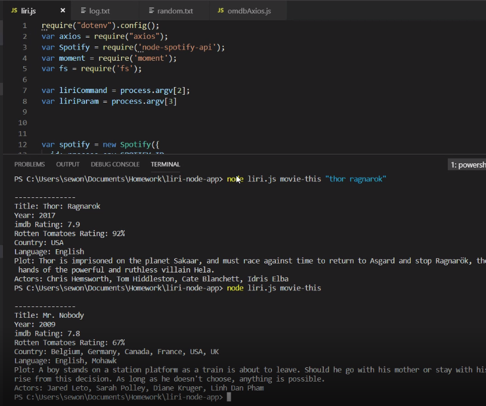
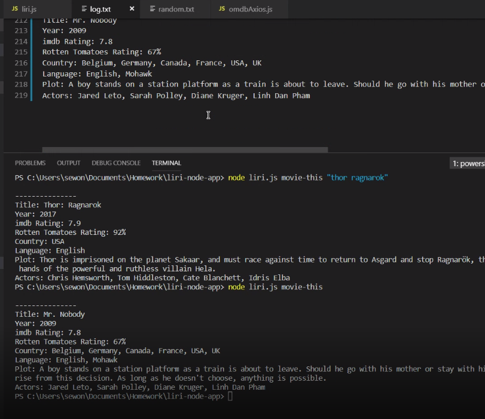
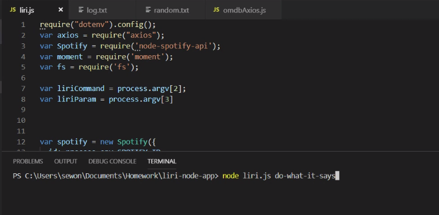
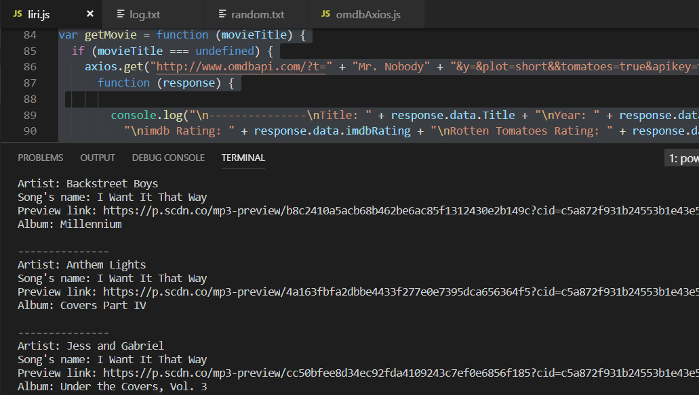

# liri-node-app
LIRI is a language interpretation and recognition interface. Liri will be a command line node app that takes in parameters and gives you back data. Use this app to find information about a song, movie, or concerts of an aritist. You can also choose a random action from the random.txt file.

## Installs
To retrieve the data that will power this app, you'll need to send requests using the axios package to the Bands in Town, Spotify and OMDB APIs. You'll find these Node packages crucial for your assignment.

* Node-Spotify-API
npm install spotify

* Axios
npm install Axios

* FS
npm install fs

## Get started

### Bands in Town Artist Events
Type below in your node termial:
node liri.js concert-this <artist/band name here>

This will return below result

* Name of the venue

* Venue location

* Date of the Event 
 
 
 

### Spotify song information
Type below in your node termial:
node liri.js spotify-this-song '<song name here>'
This will return below result
* Artist(s)
* The song's name
** If no song is provided then your program will default to "The Sign" by Ace of Base.
* A preview link of the song from Spotify
* The album that the song is from
 

### OMDB movie information
Type below in your node termial:
node liri.js movie-this '<movie name here>'

This will return below result
  * Title of the movie.
  ** If the user doesn't type a movie in, the program will output data for the movie 'Mr. Nobody.'
  * Year the movie came out.
  * IMDB Rating of the movie.
  * Rotten Tomatoes Rating of the movie.
  * Country where the movie was produced.
  * Language of the movie.
  * Plot of the movie.
  * Actors in the movie.
  
 
 
 
### random: execute the command in random.txt file
Type below in your node termial:
node liri.js do-what-it-says

 
 

## Result log
You can find all the results of your commands in log.txt file

## Demo video 
The demo video shows how the app works
https://drive.google.com/open?id=1TEVYHvaDZSBBS6S7HJ1wIgcc9RKsuUeo
